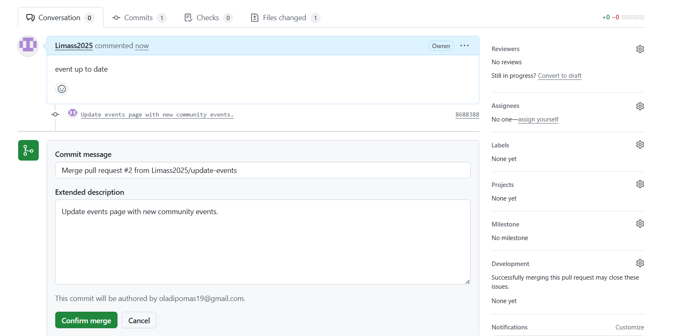

# greenwood-library-website
FIRST CAPSTONE PROJECT GIT
# Greenwood Community Library Website

## Repository Setup
- Created a repository named `greenwood-library-website` on GitHub.
- Initialized with a `README.md` file.

## Initial Setup
- Cloned the repository to the local machine.
- Created web pages: `home.html`, `about_us.html`, `events.html`, `contact_us.html`.
- Added random content to each page.
- Staged, committed, and pushed changes to the main branch.

## Morgan's Work: Adding Book Reviews
- Created a branch named `add-book-reviews`.
- Added a new file `book_reviews.html`.
- Staged, committed, and pushed changes to the `add-book-reviews` branch.
- Raised a PR and merged the changes to the main branch.

## Jamie's Work: Updating Events Page
- Created a branch named `update-events`.
- Updated the `events.html` file with new content.
- Pulled the latest changes from the main branch.
- Staged, committed, and pushed changes to the `update-events` branch.
- Raised a PR and merged the changes to the main branch.

## Evidence
              
